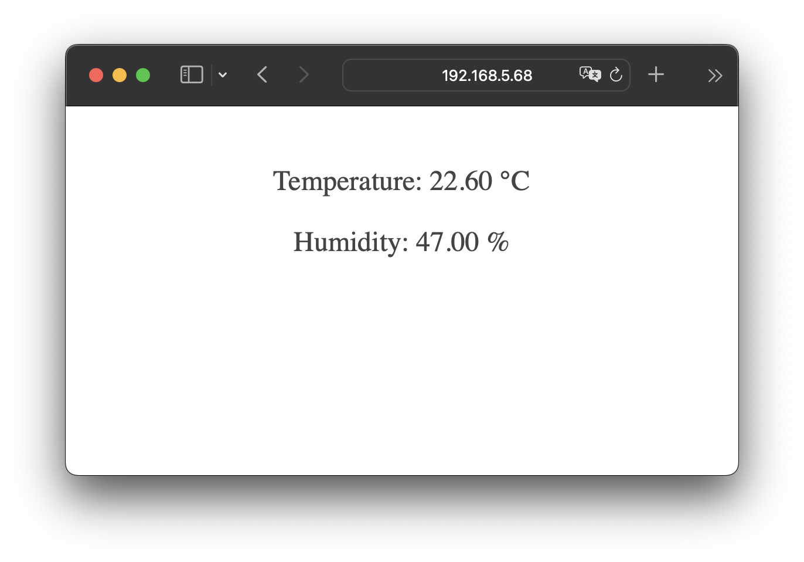

# OverlycomplicatedDigitalThermometer
I build a IOT device to display ambient temperature and humidity values. 

##### Components used:
- Wemos D1 R1 arduino with ESP8266 module
- DHT11 sensor
- OLED 128X64 i2c display
- 4xAA rechargeable battery pack

Arduino Code: TempSensor/TempSensor.ino

##### IOT device

